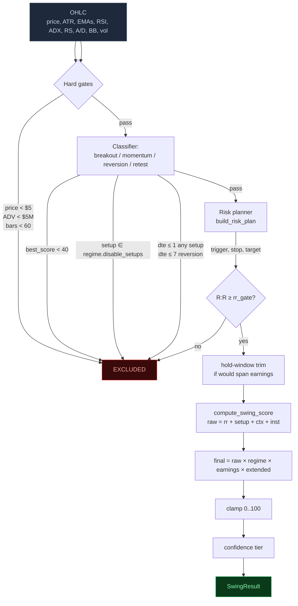
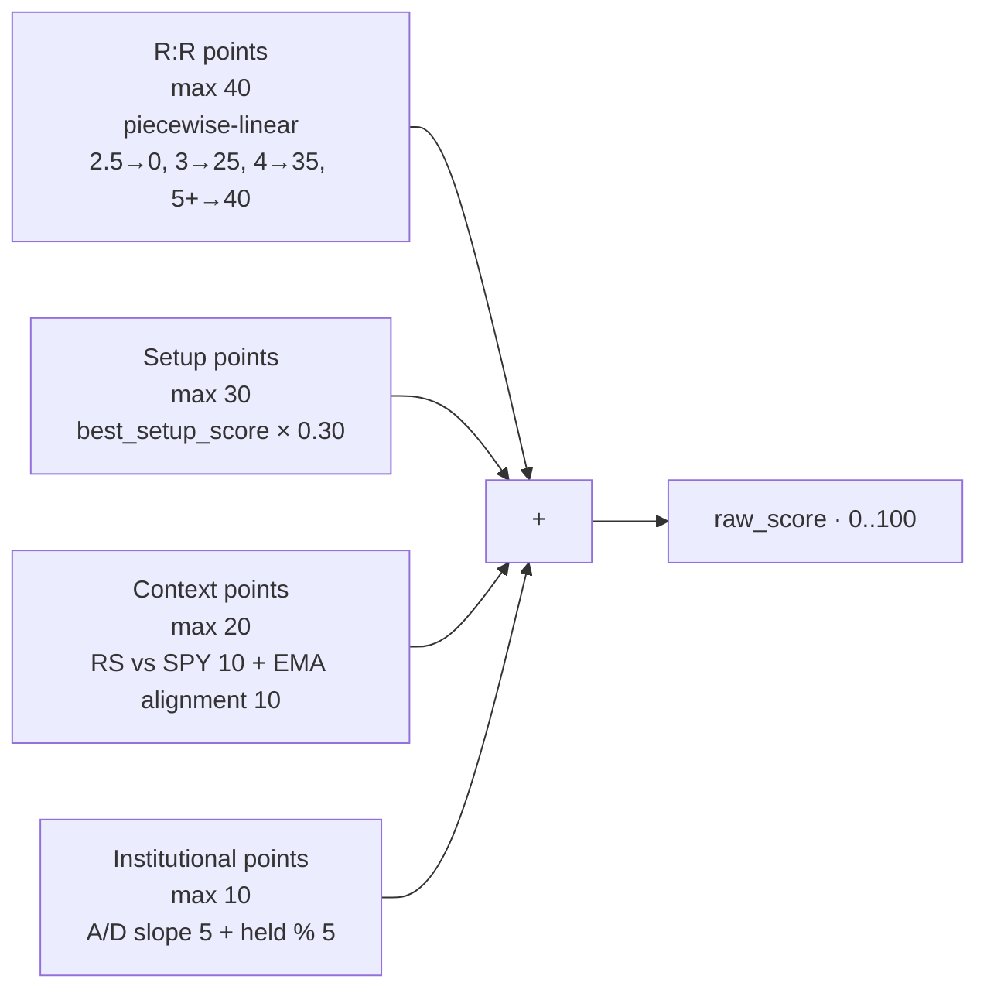
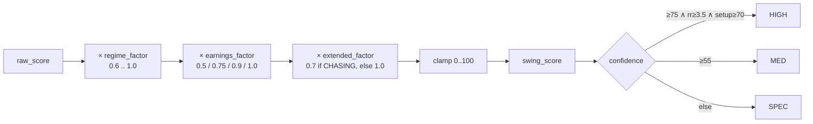
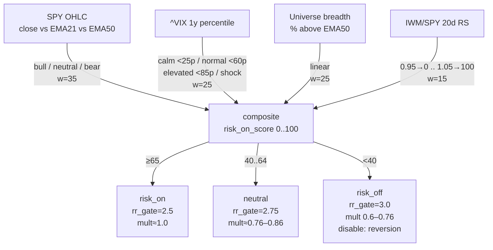
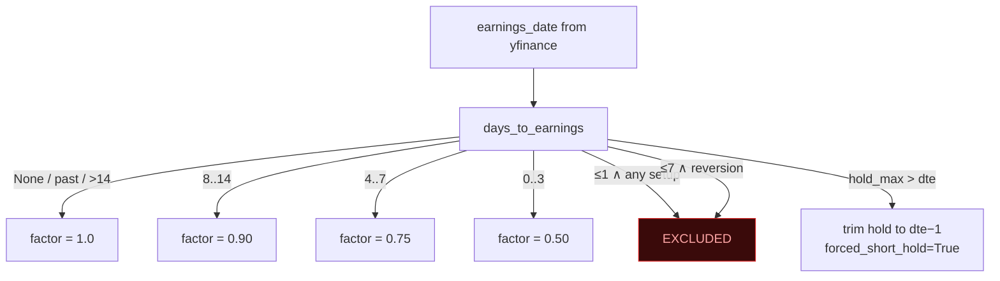

# Swing Tab — Implementation Guide

**Scoring version:** v2.0.0 · **Status:** Production · **Last updated:** 2026-05-11

This document describes how the Swing tab is implemented end-to-end: what each
column means, what the backend does to produce each value, and the assumptions
behind every design choice.

For the formal calibration table see [SCORING_REFERENCE.md](../SCORING_REFERENCE.md#swing-trading-screener-swing--v200).
For architectural decisions see ADR-0009 (original design), [ADR-0010](adr/0010-swing-regime-engine.md),
[ADR-0011](adr/0011-swing-event-risk-scoring.md), [ADR-0012](adr/0012-swing-hybrid-scoring.md).

---

## 1. Mental model

The Swing tab finds 1–3 week long stock trades using **four classical setups**
(Breakout, Momentum, Reversion, Retest), scored against a **market-regime
backdrop**, with **event risk** (earnings) priced in.

Every result row is a complete, ready-to-trade plan:

> "Buy {symbol} at {entry} (which is a {trigger_kind}, not the current price).
> Stop at {stop}. Target {target}. R:R is {rr}. Hold {hold_min}–{hold_max} days.
> Final score {swing_score}/100 is the additive raw {raw_score} times regime
> ×{multipliers.regime} × earnings ×{multipliers.earnings} × extended
> ×{multipliers.extended}."

Nothing in the UI is opinion — everything is a deterministic projection of the
OHLC, IV, ownership, and calendar data the screener fetched for that symbol.

---

## 2. Architecture (request → response)

```mermaid
flowchart LR
    UI[SwingInput<br/>Run / Scan] -->|GET /swing/scan<br/>POST /swing| R[routers/swing.py]
    R -->|run_scan symbols, 4| S[services/swing_service.py]
    S -->|stage 1<br/>parallel pre-fetch| Y1[yfinance OHLC<br/>per symbol]
    S -->|stage 2<br/>once per scan| RG[services/swing/regime.py<br/>compute_regime]
    RG -->|fetch ^VIX + IWM| Y2[yfinance]
    S -->|stage 3<br/>parallel score| PS[process_symbol]
    PS -->|features| CL[services/swing/classifier.py]
    PS -->|risk plan| RP[services/swing/risk.py]
    PS -->|composite| SC[services/scoring/swing.py]
    S -->|returns (rows, regime)| R
    R -->|response| UI
```

Strict layering: routers validate and serialise; services own all math;
services never import FastAPI types.

---

## 3. Scoring flow — one symbol



### 3.1 Hard gates (in order)

| Gate | Threshold | Constant |
|------|----------:|----------|
| Price | ≥ $5 | `MIN_PRICE` |
| Average daily $ volume | ≥ $5,000,000 | `MIN_ADV_USD` |
| OHLC history | ≥ 60 bars | hard-coded |
| Setup score | ≥ 40 / 100 | `MIN_SETUP_SCORE` |
| Regime gate (R:R) | dynamic, see §5 | `RegimeState.rr_gate` |
| Stop distance | ≤ 50% of entry | `risk.build_risk_plan` |
| Earnings ≤ 1d (any setup) | excluded | `EARNINGS_HARD_BLOCK_DAYS` |
| Earnings ≤ 7d (reversion only) | excluded | `EARNINGS_REVERSION_BLOCK_DAYS` |
| Setup ∈ `regime.disable_setups` | excluded | regime engine |

Failing any gate returns a row tagged `setup_type="excluded"` with a human-readable
reason; the UI hides excluded rows from the main list but the data is available
for debugging.

---

## 4. Hybrid scoring (additive within, multiplicative across)

### 4.1 Raw composite (0..100)



### 4.2 Cross-bucket multipliers



**Why multiplicative?** Adding penalties can't express conditional severity. A
hostile regime + near-earnings + chasing entry should compound, not just sum.
0.6 × 0.5 × 0.7 = 0.21 turns a fully-loaded 100 raw into a 21 final — exactly
the haircut the audit asked for. ADR-0012 explains the choice formally.

**Why never zero?** The multipliers floor at 0.6 / 0.5 / 0.7 deliberately. A
zero would conflate "regime hostile" with "no data" and break the audit trail.
Punishment, not erasure.

---

## 5. Regime engine (computed once per scan)



Outputs flow to:
- **`rr_gate`** — replaces the static 2.5 minimum in `process_symbol`.
- **`multiplier`** — multiplied into every symbol's composite.
- **`disable_setups`** — setups in this list are excluded as a hard gate.
- **`degraded`** — `True` when any input fetch failed; UI renders a warning.

Failure mode: `compute_regime` never raises. Missing data falls back to the
neutral default (50) and degrades the state but keeps the scan running.
See [ADR-0010](adr/0010-swing-regime-engine.md).

---

## 6. Event risk (earnings)



**Why graduated?** IV crush + binary-outcome risk are continuous in proximity,
not step functions. A T-2 setup is qualitatively different from T-7. See
[ADR-0011](adr/0011-swing-event-risk-scoring.md).

---

## 7. Setup detectors (the four families)

Each detector returns a 0..100 score; `classifier.classify_setup` picks
`best_setup = argmax(scores)`. Within-setup multipliers refine the raw score
*before* the cross-bucket composition runs.

| Setup | Hold | Strongest signals | Within-setup multiplier |
|-------|------|-------------------|-------------------------|
| **Breakout** | 5–10d | tight base ≥7d (range ≤8%), 1.5× volume surge, structure-high reclaim, BB squeeze <25p | `vol_factor = max(0.5, min(1.0, surge_ratio/1.5))` — no volume → 0.5× |
| **Momentum** | 7–14d | EMA stack ≥7/9, ADX ≥22 with +DI dominant, RS vs SPY >1.1, MACD histogram zero-cross | `align_factor = max(0.6, min(1.0, ema_score/7))` — broken stack → 0.6× |
| **Reversion** | 3–7d | RSI <30, Stoch %K <20, bullish RSI divergence, Fib 0.618 hold | **hard floor**: `if price < EMA200 → score = 0` |
| **Retest** | 10–21d | structure reclaim 5–20 bars ago, new base, RS ≥1.0 | `× 0.5` outside [5, 20] bars-since-reclaim window |

Per-setup **structural triggers** (used for entry and R:R math, NOT current price):

| Setup | Trigger | Stop |
|-------|---------|------|
| Breakout | `base_high` | base_low or `entry − 1.5×ATR` (tighter) |
| Momentum | `EMA8` (pullback) | `entry − 1.5×ATR` |
| Retest | `reclaim_level` | reclaim − 1.5×ATR |
| Reversion | current price | `recent_10d_swing_low` or `entry − 1.5×ATR` |

If `current_price > trigger × 1.03` the row is tagged `extended=True` (CHASING in
the UI) and the `extended_factor=0.7` multiplier fires.

---

## 8. Frontend — column reference

The table renders [`SwingResult[]`](../frontend/src/types/swing.ts). Default
sort is `swing_score desc`. Clicking a row expands a detail panel showing
drivers, multipliers, and the full Score Breakdown.

| Column | Source field | Format | Notes |
|--------|--------------|--------|-------|
| Symbol | `symbol` | text | `⚠` appended when `earnings_warning` is true (≤10d) |
| Price | `price` | `$X.XX` | Latest close at scan time |
| Setup | `setup_type` | colored text | blue=breakout, green=momentum, amber=reversion, purple=retest |
| Score | `swing_score` | colored number | green ≥75 · light-green ≥65 · amber ≥55 · orange ≥45 · red <45 |
| Confidence | `confidence` | badge | HIGH (green) / MED (amber) / SPEC (purple) |
| R:R | `rr` | colored number | green ≥3.5 · light-green ≥2.75 · amber ≥2.5 · red < gate |
| Entry (trigger) | `entry` + `trigger_kind` | `$X.XX` + tag | tag: `break ↑` / `pull → EMA8` / `confirm` / `retest` / `at close`; `CHASING` if `extended` |
| Stop | `stop` | red `$X.XX` | Tighter of `entry − 1.5×ATR` or recent 10d swing low |
| Target | `target` | green `$X.XX` | `entry + R_mult × (entry − stop)` |
| Hold | `hold_min_days` – `hold_max_days` | `N–Nd` | Auto-trimmed if it would span earnings |
| Setup pts | `setup_score` | `N/100` | Raw detector score, pre-multipliers |

### 8.1 Expanded row contents

Clicking a row opens a panel with:

- **Drivers** — bullet list of the signals the classifier latched onto.
- **Raw score → multipliers → final** — every term visible so the haircut path
  is auditable. If `forced_short_hold`, an indicator explains why.
- **Score Breakdown table** — R:R / Setup / Context / Institutional pre-multiplier points.
- **Setup Scores** — all four detectors' scores (best is bold).
- **AI commentary** (top 3 only) — `narrative` + `risk_note` strings from
  Azure OpenAI gpt-4.1 generated for the highest-ranked setups.

### 8.2 Header regime banner

Shown above the table whenever a scan has completed:

| Element | Source | Meaning |
|---------|--------|---------|
| Label pill | `regime.regime_label` | risk_on (green) / neutral (grey) / risk_off (red) |
| Score | `regime.risk_on_score` | 0..100 composite |
| R:R gate | `regime.rr_gate` | Used for the dynamic hard gate |
| Multiplier | `regime.multiplier` | Applied to every symbol's composite |
| SPY | `regime.index_trend` | bull / neutral / bear |
| VIX | `regime.vix` + `regime.vix_percentile` + `regime.vol_regime` | latest level + 1y percentile + label |
| Breadth | `regime.breadth_pct` | % of universe above EMA50 |
| IWM/SPY | `regime.risk_appetite` | 20d small-cap RS |
| Disabled | `regime.disable_setups` | yellow tag |
| Degraded | `regime.degraded` | yellow `⚠ degraded data` when any fetch failed |

---

## 9. Assumptions and rationale

### 9.1 Why these four setups?

They span the four canonical edge sources in equity swing trading:

| Setup | Edge source |
|-------|-------------|
| Breakout | Volatility compression → expansion (squeeze releases) |
| Momentum | Trend persistence (autocorrelation in returns) |
| Reversion | Oversold within an intact long-term trend |
| Retest | Confirmation of a prior breakout (lower-risk re-entry) |

Anything else (gap-and-go, IPO base, etc.) is a sub-flavour of one of these.
Keeping the count to four lets each detector be deeply calibrated rather than
shallow across many.

### 9.2 Why structural triggers, not current price?

Original v1 used `entry = current_close`. This created two failure modes:

1. **R:R penalised extended winners.** A name 6% past its breakout level had
   an artificially poor R:R because the stop got proportionally further while
   the target stayed fixed.
2. **The UI showed a trade you couldn't take.** Telling a user to "buy at
   $182.50" when the current price is $185 is misleading.

Per-setup triggers (§7) compute R:R off the proper entry and then flag CHASING
when the current price is materially past it. The R:R points reward the trade
geometry, and the `extended_factor` penalises the chase separately.

### 9.3 Why hybrid scoring instead of pure additive or pure multiplicative?

- **Pure additive** can't express conditional severity (regime, earnings,
  CHASING all compound, not sum).
- **Pure multiplicative** would force re-deriving every factor's distribution
  from first principles — the existing 40/30/20/10 budget bakes in years of
  manual calibration.

Hybrid keeps within-bucket addition (calibration intact) and adds across-bucket
multiplication (conditionality unlocked). See [ADR-0012](adr/0012-swing-hybrid-scoring.md).

### 9.4 Why a global regime, not per-symbol?

Regime is a property of the market, not the symbol. Computing it n times wastes
work and introduces inconsistency across the scan as upstream data updates.
One regime per scan, computed once in `run_scan` and returned alongside the
rows tuple, used by all symbols and exposed at `GET /api/screener/swing/regime`.

### 9.5 Why these specific VIX bands (25p / 60p / 85p)?

The 1y percentile rank is calibrated against the empirical distribution of
VIX-only-during-trading-days from 1990–present:

- Below 25th percentile is "calm" — VIX ≲ 14 in normal regimes, ≲ 18 in elevated.
- 25–60 is "normal" — the noisy middle band where most days live.
- 60–85 is "elevated" — meaningful risk-off but not panic.
- ≥ 85 is "shock" — historically associated with sharp drawdowns and IV crush
  reversals; reversion setups have especially poor expectancy here.

### 9.6 Why earnings gates differ by setup?

Reversion is uniquely hostile to binary catalysts — mean-reversion edge collapses
through earnings, and the underlying technical signal (RSI oversold, fib hold)
typically resets after the gap. Breakout/momentum/retest can survive earnings if
the move continues, so they get a haircut (multiplier) rather than exclusion.
The 1-day universal block protects from "earnings tomorrow, this trade is
already wrong."

### 9.7 Why a fixed 0.5 floor on `earnings_factor` and 0.6 on regime?

Some near-earnings trades genuinely work (post-results continuation, expected
beats on names that have already run). The floor preserves their visibility for
discretionary review while ensuring they can't beat a clean-tape setup. Same
logic for regime: trading is still possible in risk-off, just selectively.

### 9.8 Why pre-fetch OHLC in a separate stage?

Two reasons:
1. **Regime needs the universe.** Breadth = % of names above their EMA50.
   Computing it requires the OHLC frames anyway, so doing the fetch once and
   passing it to both regime + scoring saves N redundant calls.
2. **Failure isolation.** A symbol that fails to fetch is dropped from the
   scoring stage cleanly; regime continues with whatever fetched successfully.

### 9.9 Why is the universe statically curated?

`backend/services/universe.py:swing_eligible` is a hand-maintained list of
~160 names. Rationale (also documented in `.github/copilot-instructions.md`):
- An algorithmic universe (e.g., "top 500 by liquidity") drifts daily and makes
  results non-reproducible.
- The screener's edge is in setup geometry, not in finding "the next NVDA" —
  it's a tool for trading the names you'd consider anyway.
- Curated lists are auditable; algorithmic ones aren't.

### 9.10 What's NOT modelled (intentionally)?

- **Sector / industry rotation.** A planned Phase A.3 overlay (`sector_map.py`)
  will add an additional ~0.85× multiplier when the symbol's sector ETF is in a
  bear stack. Currently not shipped.
- **Options-flow / dark-pool prints.** Out of scope; the screener uses public
  yfinance data only.
- **Position sizing.** The screener publishes risk_per_share and target; the
  trader decides position size against their per-trade budget.
- **Backtest expectancy.** Each setup has a calibrated edge from manual review,
  not a back-tested win/loss distribution. A formal backtest harness is
  Track-A future work.

---

## 10. File map

| File | Responsibility |
|------|----------------|
| [backend/routers/swing.py](../backend/routers/swing.py) | HTTP endpoints; serialises `SwingResult` and `RegimeState`. |
| [backend/services/swing_service.py](../backend/services/swing_service.py) | Orchestration: pre-fetch, regime, parallel scoring, hard gates, hold trim. |
| [backend/services/swing/regime.py](../backend/services/swing/regime.py) | Global regime engine (SPY / VIX / breadth / IWM-SPY). |
| [backend/services/swing/classifier.py](../backend/services/swing/classifier.py) | Four setup detectors with within-setup multipliers. |
| [backend/services/swing/risk.py](../backend/services/swing/risk.py) | Structural triggers, stops, targets, R:R. |
| [backend/services/swing/indicators.py](../backend/services/swing/indicators.py) | EMA / ATR / ADX / RSI / BB / A/D / RS / volume surge primitives. |
| [backend/services/scoring/swing.py](../backend/services/scoring/swing.py) | `compute_swing_score` — additive raw + multiplicative composition. |
| [backend/services/scan_cache.py](../backend/services/scan_cache.py) | TTL cache for per-strategy scan results. |
| [frontend/src/hooks/useSwing.ts](../frontend/src/hooks/useSwing.ts) | Fetch + cache + regime state. |
| [frontend/src/components/SwingInput.tsx](../frontend/src/components/SwingInput.tsx) | Scan / custom controls + Score Guide. |
| [frontend/src/components/SwingTable.tsx](../frontend/src/components/SwingTable.tsx) | Results table + expanded row + multipliers panel. |
| [frontend/src/components/SwingFilterPanel.tsx](../frontend/src/components/SwingFilterPanel.tsx) | Post-scan filters (setup, confidence, score, R:R). |
| [frontend/src/App.tsx](../frontend/src/App.tsx) | Regime banner + page composition. |

---

## 11. Glossary

- **raw_score** — pre-multiplier additive composite (0..100).
- **swing_score** — final, post-multiplier, clamped score shown in the table.
- **multipliers** — `{regime, earnings, extended}` floats, each ≥ their floor.
- **trigger_kind** — symbolic label of the structural entry (`break_above`,
  `pullback_to_ema8`, `reclaim_confirm`, `retest_of`, `market_close`).
- **extended / CHASING** — `True` when current price > 1.03 × trigger.
- **forced_short_hold** — `True` when the natural hold window was trimmed to
  avoid spanning earnings.
- **rr_gate** — dynamic R:R minimum from the regime engine.
- **regime_label** — `risk_on` / `neutral` / `risk_off`.
- **degraded** (regime) — `True` when any input data fetch fell back to a
  neutral default.
